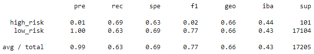
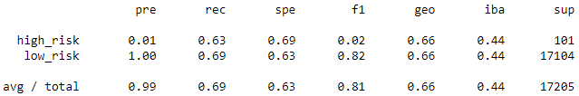
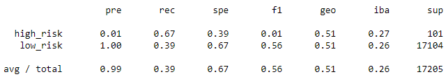
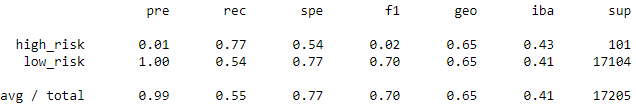
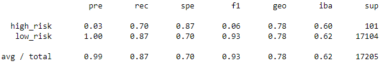
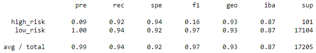

# Credit Risk Analysis

## Overview of Analysis
Uses various machine learning models to evaluate the credit risk from a large dataset of loan history with many features. The target column of loan_status is highly unbalanced, with most loans being considered "low risk" so resampling methods are tested with logistic regression being the algorithm used to classify into either the "low risk" or "high risk" classes. The resampling methods used include naive random oversampling, Synthetic Minority Oversampling Technique (SMOTE), Cluster Centroids Undersampling, and SMOTEEN combination sampling; each approach is evaluated by generating a balanced accuracy score, confusion matrix and examining the imbalanced classification report for the model.

Additionally the ensemble classification algorithms Balanced Random Forest Classifier and Easy Ensemble Boosting Classifier are utilized and their performance similarly evaluated. These two algorithms from the Imbalanced-learn library utilize undersampling to balance the dataset for the ensemble learners.

## Results

### Naive Random Oversampling

* Balanced Accuracy Score: 0.660
* High Risk Loan Precision: 0.01
* High Risk Loan Recall: 0.69
* Low Risk Loan Precision: 1.00
* Low Risk Loan Recall: 0.63

### SMOTE Oversampling

* Balanced Accuracy Score: 0.662
* High Risk Loan Precision: 0.01
* High Risk Loan Recall: 0.63
* Low Risk Loan Precision: 1.00
* Low Risk Loan Recall: 0.69

### Cluster Centroid Undersamping

* Balanced Accuracy Score: 0.532
* High Risk Loan Precision: 0.01
* High Risk Loan Recall: 0.67
* Low Risk Loan Precision: 1.00
* Low Risk Loan Recall: 0.39

### SMOTEEN

* Balanced Accuracy Score: 0.659
* High Risk Loan Precision: 0.01
* High Risk Loan Recall: 0.77
* Low Risk Loan Precision: 1.00
* Low Risk Loan Recall: 0.54

### Balanced Random Forest Classifier

* Balanced Accuracy Score: 0.789
* High Risk Loan Precision: 0.03
* High Risk Loan Recall: 0.70
* Low Risk Loan Precision: 1.00
* Low Risk Loan Recall: 0.87

### Easy Ensemble AdaBoost Classifier

* Balanced Accuracy Score: 0.932
* High Risk Loan Precision: 0.09
* High Risk Loan Recall: 0.92
* Low Risk Loan Precision: 1.00
* Low Risk Loan Recall: 0.94

## Summary

### General Model Evaluation Summary
The model that performed the best overall is the Easy Ensemble AdaBoost Classifier, producing a high accuracy score of 0.932 and being the most reliable at correctly identifying high risk loans with a recall score of 0.92. The Random Forest Classifier also outperformed any of the models that used Logistic Regression regardless of which sampling technique was used to try to balance the data, with an accuracy score of 0.789, making it the 2nd best model tested.

For the models utlizing Logistic Regression, the best sampling technique to attempt to balance the dataset was the SMOTE Oversampling, with Cluster Centroid Undersampling being the worst. This makes some sense as the oversampling methods involved over 500,000 samples for the training data vs. the 246 used in the undersampling technique. While undersampling as a method for balancing ensemble models appear to produce good models as they utilize many weak learners which guards against underfitting, this isn't the case for the Logistic Regression algorithm.

### Recommended Model
Evaluating if any of the models can be recommended requires examining how acceptable falsely flagging someone's credit risk as high when it is in fact low is, and to what degree? Identifying actual high risk borrowers is the goal, and success in doing so should be weighted higher accordingly. However, if an algorithm is too aggressive and is relied on as a sole indicator of risk, safe borrowers might get flagged as high risk mistakenly which results in an opportunity loss.

Such is the case with all the models investigated in the analysis, where each scored abysmally low in precision for the high risk category, indicating that there are few truly high risk accounts out of those predicted to be high risk - in other words, there are many low risk borrowers identified as high risk mistakenly. While the Easy Ensemble AdaBoost Classifier model is nearly worthy of a recommendation for having a high recall it is not an acceptable trade-off when it comes to precision, where 983 low risk borrowers are misclassified as high risk compared to an account count of 93 across 1076 predictions, coming to a precision score of only 0.09.

This model's recall of 0.92 equates to 93 of the 101 high risk accounts being correctly identified which is quite good, and if identifying this group accurately were the only concern it would easily be the recommended model. However this success doesn't balance the poor precision present.

It is also notable that when only examining within the low risk category the metrics do make the model more acceptable as well, with the precision of 1.00 and recall of 0.94. Overall the amount of accounts considered low risk greatly outnumbers high risk, which results in the stark differences in metrics. While the 983 that were misidentified as high risk do influence the recall of the low risk category, this is compared to an actual 17,104 accounts that are low risk which yields the still high recall compared to the influence this group has on the precision for high risk.

So the model loses a true recommendation very slightly due to the potential of opportunity loss, provided on whether or not it is used solely to evaluate credit risk. Is it acceptable for predicted high risk accounts to be actually low risk nearly 90% of the time, when 94% of low risk ones are still correctly identified as low risk? While more acceptable than failing to identify true high risk accounts, it is worth trying to reduce this poor precision problem. Perhaps it is impossible to reduce the precision while maintaining the sensitivity desired for detecting high risk borrowers, but ultimately investigating models further to try to increase the precision is the recommendation based on the results of this analysis.